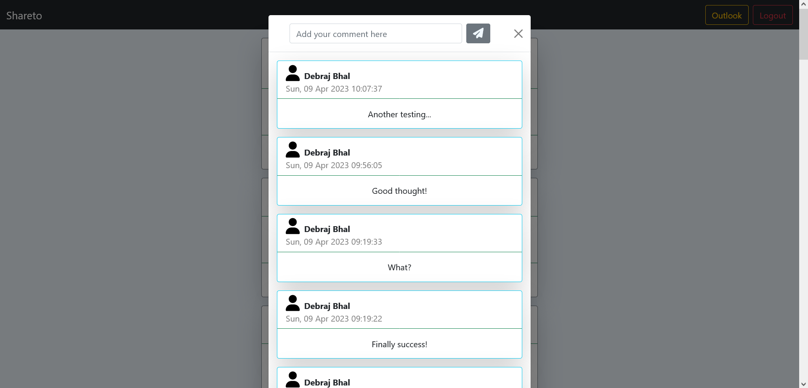

# Shareto- A Micro Blogging Application Using Spring MVC

This is a micro blogging application powered by spring mvc,that offers features you expect from a blogging application like authentication, post micro blogs, comment on others blog, like blogs and delete and update your own blogs and comments.

## Table of Contents
* [Introduction]()
* [Screenshots]()
* [Demo and link to deployed chat application]()
* [Features]()
  * [Current features]()
  * [Feature request]()
* [Technologies and tools used]()
* [Database Diagram]()
* [Bug Reporting]()
* [License]()

## Introduction
Their are few tutorials demonstrating simple crud app in spring mvc, some demonstrate login and logout, but couldn't find a beginner friendly project having all in one place. So I created in web application using spring mvc and some other backend technologies having all the above features at one project. For a developer who is willing to getting started with spring, it's a wonderful project for them.

## Screenshots

  

  

  

## Demo and link to deployed  application
I have also maade a detailed demo video for this webapp.
Check that out here <b>:</b>[https://www.youtube.com/watch?v=dYjKtP1Z6yE](https://www.youtube.com/watch?v=dYjKtP1Z6yE)

## 🚀 Features
### Current features
* An user can create an account.
* Authentication is using cookie login.
* Can post outlooks.
* Can comment and like others outlooks.
* Can edit and delete your own comments and outlooks.

### ⭐ Feature request

* Any other feature you would like to suggest ,then please open an issuefor that.😊
* Connect with me in [LinkedIn](www.linkedin.com/in/debraj-bhal). I did 💖 to hear how you feel using this app.
## Technologies and tools used
* [Spring MVC]()
* [Ajax request using Jquery]()
* [MySQL Connector]()
* [Jackson JSON Converter]()
* [CSS]()
* [JavaScript]()
* [Java]()
* [Bootstrap]()
* [JSP]()
* [JSP Template Library]()

## Database Diagram
[Link](https://drawsql.app/teams/debraj-bhal/diagrams/shareto-database-diagram)

  

## 🐛 Bug Reporting
Feel free to open an issue on github if you find any bug.
## 📜 License
This software is open source, licensed under the [MIT License](/LICENSE).